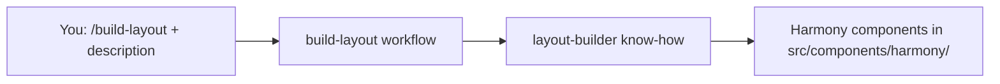

# Harmony Designer Handbook

**Kit profile — Harmony Designer Starter (React):** This folder is a **self-contained** Vite + React preview of Harmony shell and components, vendored global CSS (`harmony-styles/`), icon data (`harmony-data/`), a full **downloaded icon library** on disk (`icons/` — Tabler outline + custom SVGs so you do not need npm `@tabler/icons` or similar to browse or ship assets), and a Cursor **`.cursor/`** bundle (skills, rules, agents). It does **not** ship `harmony-converter`, multi-framework conversion playbooks, `harmony-verifier`, or `harmony-exact-replica` rules—those exist in other bundles, not in this zip.

Keep this file at the **repository root** next to `.cursor/` when you zip or share the kit (same level as `package.json`).

---

## Table of contents

### Cursor bundle

1. [What is in the zip](#what-is-in-the-zip)
2. [Installing the bundle](#installing-the-bundle)
3. [Prerequisites](#prerequisites)
4. [layout-builder and build-layout](#layout-builder-and-build-layout)
5. [Skills reference](#skills-reference)
6. [Rules](#rules)
7. [Agents (verifiers)](#agents-verifiers)
8. [Slash commands](#slash-commands)
9. [Natural-language Harmony](#natural-language-harmony-no-separate-slash-file)
10. [harmony-usage-rules and RULES.md](#harmony-usage-rules-and-rulesmd)
11. [Typical workflows](#typical-workflows)
12. [Component paths in this kit](#component-paths-in-this-kit)

### This React preview app

13. [Project layout](#project-layout)
14. [Running and theming](#running-and-theming)
15. [Styles and tokens](#styles-and-tokens)
16. [Customization notes](#customization-notes)
17. [Quick reference](#quick-reference)

---

## What is in the zip

Expected layout at the **project root**:

```text
harmony-designer-starter/
├── HARMONY_DESIGNER_HANDBOOK.md    ← this document
├── KIT_VERSION
├── CHANGELOG.md
├── AGENTS.md
├── package.json
├── harmony-styles/                 ← vendored Harmony global CSS (see Vite alias)
├── harmony-data/                   ← icon manifest and related data
├── icons/                          ← vendored SVG library (Tabler outline + custom; no npm icon pack required)
├── src/
│   ├── components/harmony/         ← React Harmony components (in-repo)
│   └── ...
└── .cursor/
    ├── skills/                     ← one folder per skill (SKILL.md each)
    ├── agents/                     ← verifier subagents
    └── rules/                      ← Cursor rules (.mdc)
```

- **`.cursor/skills/`** — Source of truth for skills ([skills-source-of-truth.mdc](.cursor/rules/skills-source-of-truth.mdc)). Do not duplicate skill trees elsewhere.
- **`.cursor/agents/`** — Verifier agents for layout and pattern fidelity workflows.
- **`.cursor/rules/`** — Layout composition, pattern fidelity, skills location.

Scripts such as `python .cursor/skills/design-patterns/scripts/search_patterns.py` are run from this project root.

---

## Installing the bundle

1. Unzip or clone so **`HARMONY_DESIGNER_HANDBOOK.md`** and **`.cursor/`** sit at the app root (with `package.json`).
2. Restart Cursor or reload the window so skills and rules load.
3. Run `npm install` and satisfy [Prerequisites](#prerequisites).

---

## Prerequisites

| Requirement | Why |
|-------------|-----|
| **Cursor** | Agent Skills, rules, and agents. |
| **Node / npm** | Install deps, `npm run dev` / `npm run build`. |
| **Python 3** (optional) | `create_pattern.py` and `search_patterns.py` under `.cursor/skills/design-patterns/scripts/`. For full YAML frontmatter: `pip install pyyaml`. |

This kit runs **without** installing `@dltkfrancesmunoz/harmony-design-system` from npm: React components and styles are included under `src/components/harmony/` and `harmony-styles/`. If you add a Harmony package later for `RULES.md`, see [harmony-usage-rules and RULES.md](#harmony-usage-rules-and-rulesmd).

---

## layout-builder and build-layout

Two related pieces: one is **know-how** (how pages should be structured in Harmony); the other is **what you run in chat** to get a new screen built.

| Piece | What it means for you |
|-------|------------------------|
| **`layout-builder`** | The rules and examples for real pages: common layouts (settings, list/detail, dashboard), what can nest inside what, spacing and grid tokens, and using `ShellLayout` with components from `src/components/harmony/`. You do not type this name—think of it as the design-and-composition guide the agent applies. |
| **`build-layout`** | When you run **`/build-layout`**, the agent follows the **build-layout** instructions: your description → a new page file and route. It uses **layout-builder** (and **design-patterns** if a matching pattern exists). |

**In this kit:** The Harmony shell is **already** in the repo (`src/components/harmony/ShellLayout.tsx` and related files). You do **not** run `/convert-shell` or use `harmony-converter`. Describe the page (and optional theme, e.g. VP dark); the agent composes with existing `.tsx` components.

Technical detail: each skill lives in `.cursor/skills/<name>/SKILL.md` (source of truth for the agent). This section explains the **designer-facing** split only.



---

## Skills reference

Skills are folders under [`.cursor/skills/`](.cursor/skills/); each has a `SKILL.md` (instructions for the agent). This kit ships **exactly** these. **Quick human summary** — what each is *for* and how you usually trigger it:

| Skill | What it’s for | Slash command (if any) |
|-------|----------------|-------------------------|
| **harmony** | Where components, `ShellLayout`, tokens, and theme/mode live; how to use Harmony in this project. | — (ask in chat, e.g. “audit this file for Harmony”) |
| **harmony-usage-rules** | Check UI against Harmony usage and accessibility; may read `RULES.md` from a Harmony npm install (see below). | — |
| **harmony-ux-principles** | Critique usability, cognitive load, and flow—with or without Harmony. | — |
| **design-patterns** | Pattern library, registry, and scripts to create or search pattern docs. | — |
| **layout-builder** | Rules for composing pages inside the shell (patterns, constraints, `src/components/harmony/`). | — |
| **build-layout** | From your description to a new page + route using the shell. | **`/build-layout`** |
| **build-all-patterns** | Build demo pages from the full pattern registry, with layout and fidelity checks. | **`/build-all-patterns`** |
| **create-pattern** | Generate a new pattern markdown file from an existing component. | **`/create-pattern`** |
| **search-patterns** | Search or list entries in the pattern registry. | **`/search-patterns`** |
| **harmony-critique** | Review a design or implementation against Harmony. | **`/harmony-critique`** |
| **ux-review** | UX-focused review (not limited to Harmony-only framing). | **`/ux-review`** |

For a short standalone copy of this table, see **[.cursor/DESIGNER_GUIDE.md](.cursor/DESIGNER_GUIDE.md)**. **Typical workflows** in that guide lists **one example prompt per skill**: **[.cursor/DESIGNER_GUIDE.md#typical-workflows](.cursor/DESIGNER_GUIDE.md#typical-workflows)**.

Index: [`.cursor/skills/README.md`](.cursor/skills/README.md).

---

## Rules

| Rule file | Purpose |
|-----------|---------|
| [skills-source-of-truth.mdc](.cursor/rules/skills-source-of-truth.mdc) | All skills live only under `.cursor/skills/`. |
| [layout-composition.mdc](.cursor/rules/layout-composition.mdc) | Token spacing, no Card-in-Card, ShellPageHeader first / button bar last, imports used. |
| [pattern-fidelity-rule.mdc](.cursor/rules/pattern-fidelity-rule.mdc) | Built pattern pages must match pattern markdown; verification gate. |

---

## Agents (verifiers)

| Agent | Role |
|-------|------|
| [layout-verifier](.cursor/agents/layout-verifier.md) | After layout composition: checks against layout-builder constraints and pattern anatomy. |
| [pattern-fidelity-verifier](.cursor/agents/pattern-fidelity-verifier.md) | After pattern page build: compares built file to pattern markdown. |

They do not replace `npm run build`; they enforce rules in this handbook and in `.cursor/agents/*.md`.

---

## Slash commands

Run these in Cursor chat. Each command is wired to a skill folder under `.cursor/skills/` (some skills use `disable-model-invocation: true`, so the slash is the reliable way to start the workflow):

| Command | Purpose |
|---------|---------|
| **/build-layout** | Compose a page inside the existing **React** Harmony shell (describe the screen; optional theme/mode). |
| **/build-all-patterns** | Build pattern demo pages from the registry with verification checkpoints. |
| **/create-pattern** | Generate a pattern doc via `create_pattern.py`. |
| **/search-patterns** | Search or list patterns via `search_patterns.py`. |
| **/harmony-critique** | Critique using harmony-usage-rules + harmony-ux-principles. |
| **/ux-review** | UX-only review (harmony-ux-principles). |

This kit does **not** ship `/convert-component`, `/convert-shell`, `/convert-all`, `/seed-patterns`, or `/generate-llms-txt`.

---

## Natural-language Harmony (no separate slash file)

Ask in plain language; the **harmony** skill covers setup, component lookup, tokens, audit, normalize, accessibility, extract, and onboarding-style flows. There is no `/harmony-audit` slash file unless your project adds one.

---

## harmony-usage-rules and RULES.md

The **harmony-usage-rules** skill loads **`{harmonyRoot}/docs/RULES.md`** when a Harmony package is available (for example `node_modules/@dltkfrancesmunoz/harmony-design-system/docs/RULES.md`). This path is **not** bundled in the zip by default. Without a package install, rely on this handbook, component source under `src/components/harmony/`, and vendored CSS under `harmony-styles/`.

---

## Typical workflows

**One example prompt per skill** (full table): **[.cursor/DESIGNER_GUIDE.md#typical-workflows](.cursor/DESIGNER_GUIDE.md#typical-workflows)**.

1. **Preview the app** — `npm install` then `npm run dev` (default port **5175**). See [Running and theming](#running-and-theming).
2. **New page in the shell** — **`/build-layout`** with a description of the screen. The agent adds a page under `src/pages/` and a route in `src/App.tsx` when applicable.
3. **Find or document a pattern** — **`/search-patterns`** or **`/create-pattern`**; edit generated markdown under `.cursor/skills/design-patterns/reference/`.
4. **Build many pattern pages** — **`/build-all-patterns`** with layout and fidelity verification checkpoints between batches.
5. **Critique** — **`/harmony-critique`** on a file or description.
6. **UX-only review** — **`/ux-review`**.

---

## Component paths in this kit

Harmony UI for this preview lives under:

```text
src/components/harmony/
```

Use `ShellLayout`, `ShellPageHeader`, `Card`, inputs, and other components from that folder (`.tsx` + colocated `.css`). The Vite config aliases `@dltkfrancesmunoz/harmony-design-system/styles` to `./harmony-styles` so global Harmony CSS resolves from this repo.

---

## Project layout

| Path | Purpose |
|------|---------|
| `src/components/harmony/` | React Harmony components (shell, form, navigation, …). |
| `harmony-styles/` | Global CSS: tokens, reset, layout, components, utilities (aliased as `@dltkfrancesmunoz/harmony-design-system/styles`). |
| `harmony-data/` | **`icon-manifest.json`:** per-theme maps with inline **`svg`** strings (and optional `source`) consumed by `Icon`. |
| `icons/` | **Vendored SVG files** (e.g. `icons/tabler/outline/*.svg`, `icons/custom/*.svg`) for browsing and handoff. At runtime, `Icon` resolves names using manifest **`svg`** data plus built-in fallbacks—not file paths in the manifest. |
| `public/` | Static assets (logos, SVGs referenced by shell). |
| `src/pages/` | Example pages (gallery, demos). |
| `src/App.tsx` | Routes and default **theme** classes on `document.documentElement`. |

---

## Running and theming

```bash
npm install
npm run dev
```

Open the URL shown (port **5175** by default). Default product theme is **`theme-ppm`** and light mode unless you add `dark` to `<html>`. To try another brand theme, adjust classes on `document.documentElement` in `src/App.tsx` (e.g. `theme-cp`, `theme-vp`, `theme-maconomy`, and `dark`). There is no in-app theme switcher in this starter.

---

## Styles and tokens

`src/main.tsx` imports global Harmony styles via the alias (see `vite.config.ts`). Prefer Harmony tokens and utility classes from the vendored sheets; avoid arbitrary pixel spacing in new UI. For token names and behavior, inspect `harmony-styles/tokens.css` and component CSS under `src/components/harmony/*.css`.

---

## Customization notes

This starter is for **preview and design workflows**, not a full production fork pipeline. For Tier-0-style tweaks, you can add or adjust CSS that overrides Harmony variables in a controlled way (see existing `src/index.css` and Harmony global imports). For a production app that consumes Harmony from npm with fork/wrapper workflows, follow your team’s separate engineering guide.

---

## Quick reference

| Task | Command / location |
|------|---------------------|
| Dev server | `npm run dev` |
| Production build | `npm run build` / `npm run preview` |
| Pattern search | `python3 .cursor/skills/design-patterns/scripts/search_patterns.py --list` |
| Skills | `.cursor/skills/` |
| Rules | `.cursor/rules/` |
| Verifier agents | `.cursor/agents/` |
| Slash details | [`.cursor/DESIGNER_GUIDE.md`](.cursor/DESIGNER_GUIDE.md) |

Kit version: see `KIT_VERSION` and `CHANGELOG.md`.

---

*End of Harmony Designer Handbook.*
